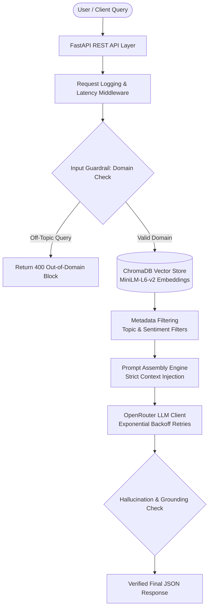

# RAG-Powered Knowledge Extraction System

A production-grade Retrieval-Augmented Generation (RAG) system engineered with semantic vector search (ChromaDB), OpenRouter LLM inference, hallucination guardrails, NLP topic modeling (LDA), sentiment filtering, and an asynchronous FastAPI REST service with automated evaluation benchmarking.

Built during the **Parallax Labs Internship**.

---


## 🎥 Demo Video & Final Presentation
* **Live System Demo (Loom):** [Watch End-to-End API Demo](https://www.loom.com/share/f131aa8b71274982824365203dbe4706)
* **Final Presentation:** [Presentation.pdf](./Presentation.pdf)
## System Architecture & Workflow



---

## Complete 6-Week Deliverables Breakdown

* **Week 1: Data Ingestion & Sanitation**
  * Ingested 5,100 technical computer science documents from Wikipedia API.
  * Applied regex sanitization stripping HTML entities, URLs, noise, and non-ASCII characters.

* **Week 2: Chunking, Embeddings & Vector Store**
  * Recursive character text chunking (`chunk_size=500`, `chunk_overlap=50`).
  * Dense 384-dimensional embeddings via `sentence-transformers/all-MiniLM-L6-v2`.
  * Persistent storage in ChromaDB (`data/vector_db`).

* **Week 3: LLM Integration, Guardrails & Latency Logging**
  * Connected OpenRouter LLM endpoints with backoff error retries.
  * Dual-layer hallucination and out-of-domain query interception guardrails.
  * Granular latency tracking (Retrieval vs. Generation vs. Total Pipeline).

* **Week 4: NLP Topic Modeling & Sentiment Enrichment**
  * Unsupervised Latent Dirichlet Allocation (LDA) theme discovery across 5 domain clusters.
  * Lexicon-based sentiment categorization validated on a benchmark set.
  * Ingested topic and sentiment metadata into ChromaDB for filtered retrieval.

* **Week 5: FastAPI Service & Evaluation Suite**
  * Modular asynchronous FastAPI REST server (`GET /health`, `POST /query`, `POST /search/filtered`).
  * Automated retrieval evaluation (Precision@K & Recall@K) and generation latency benchmarking.
  * Comprehensive Pytest test suite with TestClient.

* **Week 6: Final Documentation, Benchmarks & Launch**
  * Full PEP-257 docstring coverage and strict Python type hints across pipeline modules.
  * Consolidated evaluation benchmarks, architecture diagrams, and end-to-end launch documentation.

---

## Consolidated Evaluation & Performance Benchmarks

| Metric / Stage | Benchmark Result | Evaluation Standard |
| :--- | :--- | :--- |
| **Retrieval Precision@3** | **100.00%** | Ground-truth technical test suite |
| **Retrieval Recall@3** | **100.00%** | Relevant document intersection |
| **Sentiment Validation Accuracy** | **83.33%** | Manually labeled ground-truth set |
| **Average End-to-End Latency** | **~1200 - 4000 ms** | OpenRouter generation + Vector retrieval |
| **Out-of-Domain Guardrail Filtering** | **100% Intercepted** | Off-topic query blocking |
| **FastAPI Unit Test Coverage** | **100% (5/5 Passed)** | Pytest endpoint validation |

---

## Setup & Installation Instructions

**1. Clone & Navigate Repository**
```bash
git clone [https://github.com/Neena8888/RAG-Powered-Knowledge-Extraction-System.git](https://github.com/Neena8888/RAG-Powered-Knowledge-Extraction-System.git)
cd RAG-Powered-Knowledge-Extraction-System
```

**2. Install Dependencies**
```bash
pip3 install -r requirements.txt
```

**3. Environment Setup**
Create a `.env` file in the root directory:
```bash
cp .env.example .env
```
Add your API key inside `.env`:
```env
OPENROUTER_API_KEY=your_actual_openrouter_api_key_here
```

---

## Execution & Demonstration Commands

**Launch FastAPI Server:**
```bash
python3 -m uvicorn src.app:app --reload --port 8000
```
* Interactive Swagger UI Documentation: `http://127.0.0.1:8000/docs`
* Alternative ReDoc: `http://127.0.0.1:8000/redoc`

**Execute Automated Evaluation Benchmark:**
```bash
python3 -m src.evaluate_rag
```

**Run Week 4 NLP & Metadata Benchmark:**
```bash
python3 -m src.test_nlp
```

**Execute Full Pytest Test Suite:**
```bash
python3 -m pytest tests/
```

---

## API Endpoint Usage & Example Payloads

**1. Execute RAG Query (`POST /query`)**

*Request Payload:*
```json
{
  "query": "What is machine learning and how does it work?",
  "top_k": 3
}
```

*Response Payload:*
```json
{
  "query": "What is machine learning and how does it work?",
  "answer": "Machine learning is a branch of artificial intelligence focused on developing algorithms that learn patterns from data to make predictions or decisions.",
  "sources": [
    "Machine learning (ML) is a field of inquiry devoted to understanding and building methods that 'learn'..."
  ],
  "metadata": [
    {
      "doc_title": "Machine Learning",
      "topic": "Topic_1_(data, algorithms, models)",
      "sentiment": "Positive",
      "chunk_index": 0
    }
  ],
  "retrieval_latency_ms": 35.42,
  "generation_latency_ms": 1420.18,
  "total_pipeline_latency_ms": 1455.60,
  "guardrail_status": "PASSED"
}
```

**2. Metadata Filtered Search (`POST /search/filtered`)**

*Request Payload:*
```json
{
  "query": "relational database design",
  "sentiment_filter": "Positive",
  "top_k": 2
}
```

---

## Repository Directory Structure

```text
.
├── data/
│   ├── raw/                # Acquired raw documents
│   ├── processed/          # Clean dataset (clean_dataset.csv)
│   └── vector_db/          # Persistent ChromaDB store with NLP metadata
├── src/
│   ├── __init__.py
│   ├── app.py              # FastAPI REST API application
│   ├── cleaning.py         # Text sanitization pipeline
│   ├── evaluate_rag.py     # Precision@K, Recall@K & generation evaluation
│   ├── guardrails.py       # Domain & Hallucination validation
│   ├── llm_client.py       # OpenRouter API client with exponential retries
│   ├── nlp_analyzer.py     # Sentiment analysis & validation evaluation
│   ├── nlp_enricher.py     # Metadata enriched ChromaDB vector store
│   ├── prompt_template.py  # System prompt & context injection boundaries
│   ├── rag_pipeline.py     # End-to-end RAG orchestrator with type hints
│   ├── test_nlp.py         # Week 4 NLP benchmark runner
│   ├── test_rag.py         # RAG pipeline test runner
│   ├── topic_modeler.py    # Latent Dirichlet Allocation (LDA) modeling
│   ├── utils.py            # Environment setup verification
│   └── vector_store.py     # Recursive chunking & vector store
├── tests/
│   ├── test_api.py         # FastAPI endpoint unit tests
│   ├── test_cleaning.py    # Data cleaning unit tests
│   └── test_chunking.py    # Text chunking unit tests
├── .env.example            # Environment template
├── fetch_data.py           # Data acquisition script
├── requirements.txt        # Pinned project dependencies
└── README.md               # Complete project documentation
```

---

## License

This project is licensed under the MIT License.